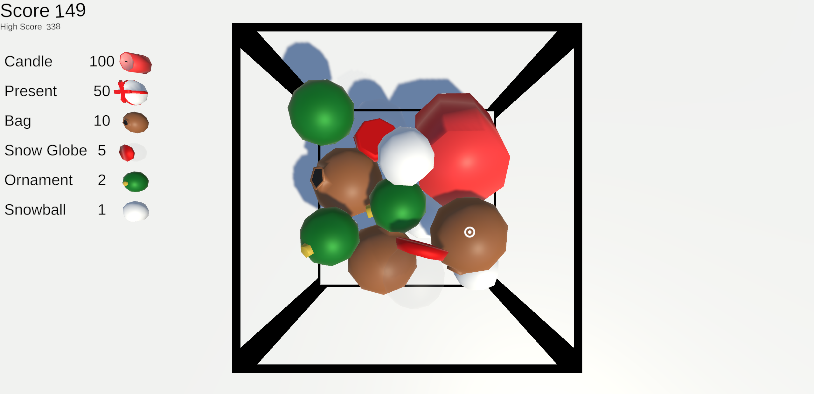

# Suika

A 3D version of the classic fruit game [Suika](https://en.wikipedia.org/wiki/Suika_Game) with a christmas twist.

## Installation

Install [Unity 6](https://unity.com/releases/unity-6) to open the project.

## Usage

In game, use your mouse to control the pointer, pressing the left mouse button spawns a snowball.
The goal is to hit the maximal score without the objects falling out of the basket.

## Contributing

This is for a school project and is not open for contributions.

## License

This project is licensed under the MIT License - see the [LICENSE](./LICENSE) file for details.
